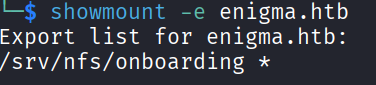

## Machine Summary

- **Name:** Enigma
- **Platform:** HackTheBox
- **OS:** Linux
- **Difficulty:** Easy
- **XP Reward:** 585
- **Key Vulnerability:**
  - **CVE-2025-69212**: OpenSTAManager has an OS Command Injection in P7M File Processing
  - **CVE-2026-27626**: OliveTin vulnerable to OS Command Injection via `password` argument type and webhook JSON extraction bypasses shell safety checks

---

For inital enumeration, I used `nmap` to scan the machine and identify open ports and services.

```bash
sudo nmap -sC -sV --open -vv -p- -T3 enigma.htb
```

We have quite many ports open:

```text
PORT      STATE SERVICE  VERSION
22/tcp    open  ssh      OpenSSH 9.6p1 Ubuntu 3ubuntu13.16 (Ubuntu Linux; protocol 2.0)
| ssh-hostkey:
|   256 0c:4b:d2:76:ab:10:06:92:05:dc:f7:55:94:7f:18:df (ECDSA)
|_  256 2d:6d:4a:4c:ee:2e:11:b6:c8:90:e6:83:e9:df:38:b0 (ED25519)
80/tcp    open  http     nginx 1.24.0 (Ubuntu)
|_http-server-header: nginx/1.24.0 (Ubuntu)
|_http-title: Enigma Corp \xE2\x80\x94 Managed IT Solutions
110/tcp   open  pop3     Dovecot pop3d
|_pop3-capabilities: STLS TOP PIPELINING SASL RESP-CODES UIDL AUTH-RESP-CODE CAPA
|_ssl-date: TLS randomness does not represent time
| ssl-cert: Subject: commonName=enigma
| Subject Alternative Name: DNS:enigma
| Not valid before: 2026-02-18T20:33:33
|_Not valid after:  2036-02-16T20:33:33
111/tcp   open  rpcbind  2-4 (RPC #100000)
| rpcinfo:
|   program version    port/proto  service
|   100003  3,4         2049/tcp   nfs
|   100003  3,4         2049/tcp6  nfs
|   100005  1,2,3      34962/udp6  mountd
|   100005  1,2,3      37268/udp   mountd
|   100005  1,2,3      38427/tcp   mountd
|_  100005  1,2,3      59847/tcp6  mountd
143/tcp   open  imap     Dovecot imapd (Ubuntu)
| ssl-cert: Subject: commonName=enigma
| Subject Alternative Name: DNS:enigma
| Not valid before: 2026-02-18T20:33:33
|_Not valid after:  2036-02-16T20:33:33
|_ssl-date: TLS randomness does not represent time
|_imap-capabilities: listed Pre-login capabilities OK LOGINDISABLEDA0001 post-login ID LOGIN-REFERRALS STARTTLS more IMAP4rev1 ENABLE have LITERAL+ SASL-IR IDLE
993/tcp   open  ssl/imap Dovecot imapd (Ubuntu)
| ssl-cert: Subject: commonName=enigma
| Subject Alternative Name: DNS:enigma
| Not valid before: 2026-02-18T20:33:33
|_Not valid after:  2036-02-16T20:33:33
|_ssl-date: TLS randomness does not represent time
|_imap-capabilities: listed Pre-login capabilities OK AUTH=PLAINA0001 ID LOGIN-REFERRALS post-login more IMAP4rev1 ENABLE have LITERAL+ SASL-IR IDLE
995/tcp   open  ssl/pop3 Dovecot pop3d
| ssl-cert: Subject: commonName=enigma
| Subject Alternative Name: DNS:enigma
| Not valid before: 2026-02-18T20:33:33
|_Not valid after:  2036-02-16T20:33:33
|_pop3-capabilities: USER TOP PIPELINING SASL(PLAIN) RESP-CODES UIDL AUTH-RESP-CODE CAPA
|_ssl-date: TLS randomness does not represent time
2049/tcp  open  nfs      3-4 (RPC #100003)
38427/tcp open  mountd   1-3 (RPC #100005)
41213/tcp open  nlockmgr 1-4 (RPC #100021)
47839/tcp open  status   1 (RPC #100024)
56731/tcp open  mountd   1-3 (RPC #100005)
57239/tcp open  mountd   1-3 (RPC #100005)
Service Info: OS: Linux; CPE: cpe:/o:linux:linux_kernel
```

Looking at the result, we can see that there are several services running, including SSH, HTTP, POP3, IMAP, and NFS. Here we have port NFS open, which is interesting because it can be used to mount remote file systems. We will start with it first, let check the NFS shares available on the machine:

```bash
showmount -e enigma.htb
```

Nice, we have a share `/srv/nfs/onboarding` and it is accessible to everyone:

