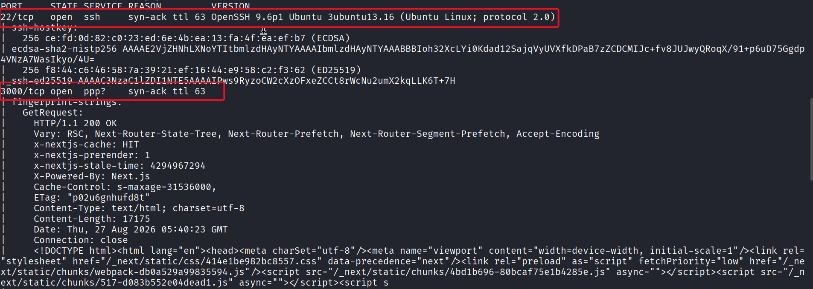
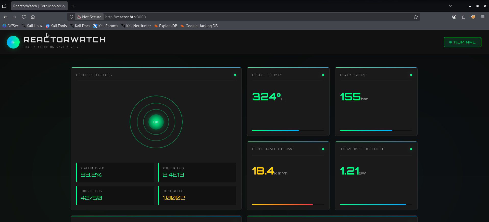
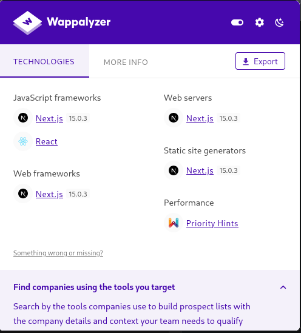
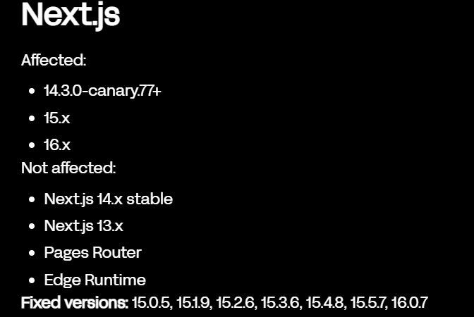

## Machine Summary

- **Name:** Reactor
- **Platform:** HackTheBox
- **OS:** Linux
- **Difficulty:** Easy
- **XP Reward:** 585
- **Key Vulnerability:** React2Shell affecting Next.js applications using App Router (CVE-2025-55182, CVE-2025-66478)

---

After starting the machine, add the IP to the `/etc/hosts` for easier access:

```bash
echo "<MACHINE-IP> reactor.htb" | sudo tee -a /etc/hosts
```

For initial enumeration, I use `nmap` to scan all open ports:

```bash
sudo nmap -sC -sV -vv --open -p- -T3 reactor.htb
```

We have 2 open ports, one run SSH and one run `ppp?` service ???:


A little bit confusing with `ppp` service but if we look at the fingerprint-strings of the Nmap output, we can see that actually a website with `http` service. Access the website:


Using [Wappalyzer](https://www.wappalyzer.com/), we know that it run on Next.js and React Native


Try to find the vulnerabilities related to that Next.js version and I found this [article](https://www.oligo.security/blog/critical-react-next-js-rce-vulnerability-cve-2025-55182-cve-2025-66478-what-you-need-to-know). Bingooo! We have one of the biggest and most widespread security exploits in 2025: **`React2Shell`**. Reading the article and we can confirm that our target is vulnerable to that:


---

## Mechanism of the React2Shell vulnerability

**`React2Shell`** refers to a critical Remote Code Execution (RCE) vulnerability in React Server Components (RSC), tracked as `CVE-2025-55182`. In Next.js applications using the App Router, the same underlying issue is tracked as `CVE-2025-66478`.

The root cause of the vulnerability lies in the way React deserializes and resolves references inside RSC/Flight payloads. An attacker can send a specially crafted request containing malicious serialized data and influence how React accesses object properties.

The vulnerable property resolution allows an attacker to traverse the JavaScript prototype chain, for example through properties such as: **`__proto__`**, **`constructor`**. This can eventually provide access to JavaScript's `Function()` constructor. By combining this with React's internal object handling and promise/thenable behavior, the attacker can cause attacker-controlled JavaScript code to be created and executed on the server.

The simple attack flow:

```
malicious HTTP Request
    ↓
RSC/Flight payload
    ↓
prototype traversal
    ↓
manipulate React Internal Object Handling
    ↓
obtain Function constructor
    ↓
build call gadget
    ↓
execute attacker-controlled JavaScript
    ↓
RCE
```

Because the vulnerable code runs on the server, successful exploitation results in code execution with the privileges of the Node.js process running the Next.js application through the App Router.

---
